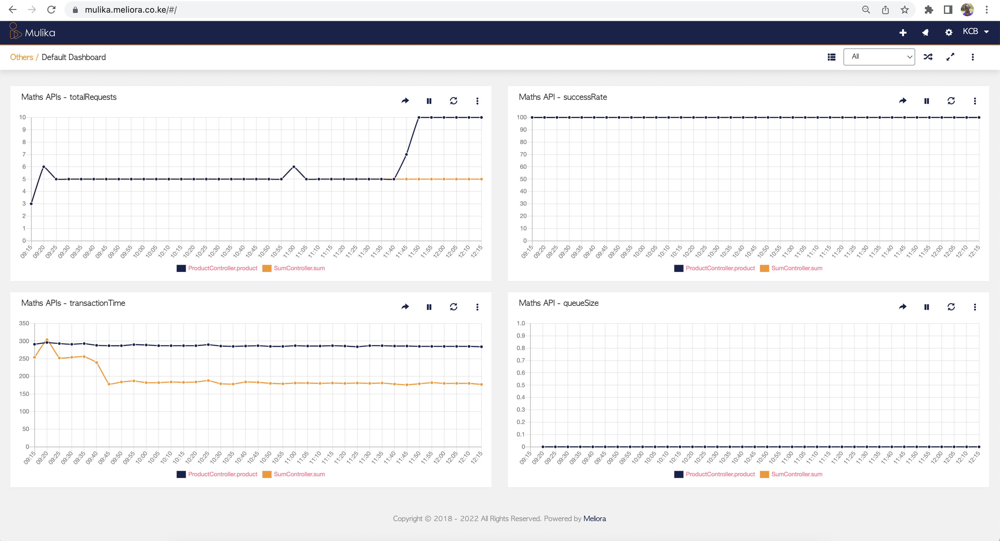

# Spring Boot Application Monitoring via Mulika

This repository is a guide to help Spring Boot developers to 
monitor their applications on Mulika. 

## 1. Introduction

### 1.1. What Mulika?
**Mulika** is a _Swahili_ name that means to illuminate. 

Mulika is a **customer experience service monitoring** tool that enables organizations to monitor various IT services or applications accessed by their customers on a 24-hour basis.

It periodically collects data in the form of **service metrics** 
or **Key Performance Indicators (KPIs)** from systems or applications being monitored,
**does aggregation**, after which the user can **visualise the data on a variety of 
graphs**, and also receive **SMS and e-mail alerts** in case of service degradation.

### 1.2 Why customer experience service monitoring?
We monitor and help you visualize KPIs that affect the customer experienc: 
+ **Total requests** - we help visualize traffic pattern and help detect anomalies. 
+ **Success rate** - success and failure rate affects customer experience. 
+ **Transaction or Request processing time** - how fast a customer request is being processing. This can be also be applied in API response time monitoring. 
+ **Queue size*** - service queue - queue size affects customer experience. 
+ **Amount** - volume of transactions being processed by the system. A drop or spike in volume may signal an issue that affects customers.
+ **Active threads** - detect thread leaks for critical applications. 
+ **Rejected requests** - in case an API or service has a throttling capability, we help you visualize this important KPI. 
+ **Delivery rate** - for sms based applications. 
+ And many more.... You can sign up here https://mulika.meliora.co.ke/ and check the online documentation

### 1.2. Collection of data
Mulika supports 3 options of collection of data: 
+ **HTTP API**  - in this repo, we are showcasing how one can integrate 
+ **DB Poller** - regular polling into your transition table. 
+ **Shell Scripts** - we can do log analysis using shell scripts and visualize the same data on Mulika dashboards.

### 1.3 Need more information? 

More information can be found here https://meliora.co.ke/product/mulika. 

## 2. Setting Up Mulika

### 2.1. Sign Up 
For you to test this repo, you need the following:
+ **Register an account** here https://mulika.meliora.co.ke/#/register-org
+ **Activate an account** after receiving the activation email. 
+ **Generate an API key** once you login - you will be guided (you will use HTTP API integration option).
+ **Clone this repository** on your local machine. 
+ **Configure your API key in file **tech.meliora.mulika.spring.monitoring.contant.MulikaConstants**
+ **Run your spring boot app** - _mvn spring-boot:run_

#### 2.2. Configure Dashboard
Once your application is sending statistics, you

## 3. Need Help? 

Leave a message here https://meliora.co.ke/contact-us and we will get back to you. 

